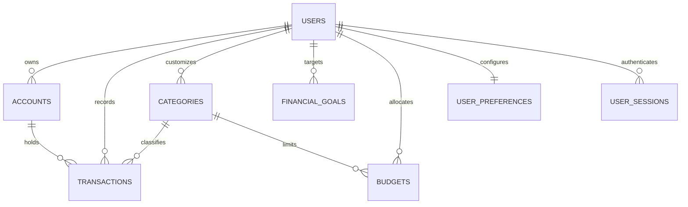

# Almanac — Comprehensive End-to-End System Analysis

---

## 1. System Architecture Overview

**Almanac** is a full-stack personal finance and autonomous financial intelligence platform built with a modern decoupled client-server architecture:

```
┌─────────────────────────────────────────────────────────────────────────────┐
│                         NEXT.JS 16 CLIENT RUNTIME                            │
│  React 19  ·  Tailwind CSS 4  ·  Recharts  ·  Framer Motion  ·  Lucide      │
│  - Brutalist CFO Design System (.cfo-*, .dash-*)                            │
│  - Dual-storage Session Hydration (localStorage + HttpOnly Cookies)        │
│  - Centralized Axios Interceptors with In-Flight Refresh Deduplication       │
└──────────────────────────────────────┬──────────────────────────────────────┘
                                       │ HTTP / REST (JSON)
                                       ▼
┌─────────────────────────────────────────────────────────────────────────────┐
│                          FASTAPI ASYNC BACKEND                              │
│  Python 3.14  ·  Pydantic v2  ·  Argon2  ·  PyJWT  ·  SQLAlchemy 2.0        │
├───────────────────┬────────────────────┬──────────────────┬─────────────────┤
│ Auth & Sessions   │ Onboarding Wizard  │ Ledger Engine    │ Dashboard & CFO │
│ - Token Version   │ - 5-Step Pipeline  │ - Accounts CRUD  │ - Net Worth     │
│ - Grace Rotation  │ - DB-backed state  │ - Balances Delta │ - Cashflow Mtrs │
│ - Revocation List │ - Initial Inflow   │ - Category Tree  │ - 4-Pillar Score│
└───────────────────┴────────────────────┴──────────────────┴─────────────────┘
                                       │ Async SQLAlchemy / psycopg3
                                       ▼
┌─────────────────────────────────────────────────────────────────────────────┐
│                        POSTGRESQL 16 LEDGER STORE                           │
│  Users · UserPreferences · UserSessions · Accounts · Transactions           │
│  Categories · Budgets · FinancialGoals                                      │
└─────────────────────────────────────────────────────────────────────────────┘
```

---

## 2. Frontend Architecture

### 2.1 Framework & Core Technologies
- **Framework**: Next.js 16 (App Router) with React 19 and TypeScript.
- **Styling**: Tailwind CSS v4, custom modular CSS (`globals.css`, `workspace.css`, `auth.css`), and an industrial brutalist design system (`cfo-panel`, `cfo-btn`, `cfo-input`, `cfo-kicker`, `cfo-coords`, `cfo-badge`).
- **Data Visualization & Motion**: Recharts (Cashflow & Allocation Charts), Framer Motion (page transitions, drawers, reveals), Lucide React (tactical UI iconography).

### 2.2 App Routing Structure
- **Root**: `frontend/app/page.tsx` — Landing page with product walkthrough and live telemetry preview.
- **Auth Routes (`frontend/app/(auth)/`)**:
  - `/signin` (`signin-form.tsx`) — Credential login with validation and session storage.
  - `/signup` (`signup-form.tsx`) — User registration.
  - Shared auth shell with ambient visual effects (`auth-shell.tsx`, `cfo-reveal.tsx`).
- **Workspace Routes (`frontend/app/(workspace)/`)**:
  - `/getting-started` (`page.tsx` & `getting-started-flow.tsx`) — Multi-step onboarding matrix.
  - `/dashboard` (`dashboard-view.tsx`) — Central command center, net worth telemetry, health index, cashflow trajectory.
  - `/accounts` (`accounts-panel.tsx`) — Bank, savings, card, and investment container management.
  - `/transactions` (`transactions-view.tsx`) — Transaction ledger, filtering, and entry forms.
  - `/budgets` (`budgets-view.tsx`) — Spending caps and real-time category pace.
  - `/goals` (`goals-view.tsx`) — Financial milestone tracking.
  - `/investments` (`investments-view.tsx`) — Asset allocations and portfolio monitoring.
  - `/debt` (`debt-view.tsx`) — Liability paydown tracking.
  - `/reports` (`reports-view.tsx`) — P&L Statement, MoM Comparison, Tax Audit, and Lifestyle Leak Detection.
  - `/settings` (`settings-hub.tsx`), `/preferences`, `/profile`, `/security` — System configuration.
  - `/cfo` (`ask-cfo-panel.tsx`) — AI financial intelligence assistant drawer.

### 2.3 State Management & Client Data Layer
- **`lib/auth-storage.ts`**: Dual storage paradigm managing access tokens in memory/localStorage and refresh tokens with cross-origin cookie support.
- **`lib/use-auth.ts`**: React hook for user state, session restoration, and authenticated action guards.
- **`lib/api.ts`**: Axios instance with:
  - Automatic `Bearer` Authorization attachment.
  - 401 silent token refresh interceptor.
  - Concurrency lock (`_refreshPromise`) preventing token rotation race conditions.
- **`lib/use-onboarding.ts`**: Global reactive subscription syncing onboarding completion status across the application.
- **`lib/dashboard/use-dashboard.ts` & `lib/ledger-api.ts`**: In-memory caching, in-flight request deduplication, and cache invalidation handlers.

---

## 3. Backend Architecture

### 3.1 Framework & Runtime
- **Runtime**: Python 3.14 async runtime managed by Uvicorn.
- **Framework**: FastAPI with Pydantic v2 schemas and validation.
- **Database Layer**: SQLAlchemy 2.0 async engine backed by `psycopg` (psycopg3) and connection pooling.

### 3.2 Modular Route Structure
1. **`/api/auth` (`api/auth.py` & `services/auth_service.py`)**:
   - Argon2id password hashing.
   - JWT Access tokens (15-min TTL) + persisted rotating Refresh tokens (7-day TTL).
   - Session tracking in `user_sessions` with User-Agent fingerprinting and token versioning.
2. **`/api/onboarding` (`api/onboarding.py`)**:
   - 5-step stateful initialization saving to PostgreSQL (`/status`, `/step-1`, `/step-2`, `/step-3`, `/step-4`, `/complete`).
3. **`/api/account` (`api/account.py` & `services/account_service.py`)**:
   - User profile mutations, workspace settings (density, alerts), financial preferences, active session revocation.
4. **`/api` Ledger Endpoints (`api/ledger.py` & `services/ledger_service.py`)**:
   - Complete CRUD for Accounts, Categories, Transactions, Budgets, and Financial Goals.
   - Mathematical balance delta calculation (`balance_delta`) accounting for asset vs. liability account types and transaction flows.
5. **`/api/dashboard` (`api/dashboard.py` & `services/dashboard_service.py`)**:
   - Computes net worth, cashflow intervals (7D, 30D, 3M, 6M, 1Y), burn rate, 4-pillar financial health score (0–100), automated recommendations, and upcoming obligations.

---

## 4. Database & Data Model

The schema uses PostgreSQL native UUID primary keys, UTC timestamp mixins, and strict database-level constraints:



### Table Definitions & Invariants
1. **`users`**: Core identity (`email`, `name`, `password_hash`, `is_active`, `token_version`).
2. **`user_preferences`**: Configuration (`density`, notification flags, `currency`, `risk_tolerance`, `monthly_savings_target_pct`, `emergency_fund_months`, `onboarding_completed`, `onboarding_step`).
3. **`user_sessions`**: Active authentication tokens (`refresh_token`, `expires_at`, `user_agent`, `revoked_at`).
4. **`accounts`**: Financial instrument containers (`name`, `account_type` [bank, savings, cash, credit_card, investment, loan], `balance` with `CheckConstraint("balance >= 0")`, `is_active`).
5. **`categories`**: Transaction taxons (`name`, `parent_id` for recursive trees, `is_system`, `user_id`).
6. **`transactions`**: Double-entry ledger events (`transaction_type` [income, expense, transfer, refund, etc.], `status` [pending, posted, cancelled], `amount` with `CheckConstraint("amount > 0")`, `transaction_date`, `account_id`, `category_id`, `transfer_account_id`).
7. **`budgets`**: Monthly expenditure limits (`monthly_limit`, `category_id`, `user_id` with `UniqueConstraint("user_id", "category_id")`).
8. **`financial_goals`**: Milestones (`target_amount`, `current_amount`, `target_date`, `goal_type`, `status`).

---

## 5. End-to-End Application Flows

### Flow A: Authentication & Session Bootstrapping
1. User enters credentials on `/signin`.
2. Frontend calls `POST /api/auth/signin`.
3. Backend verifies password hash via Argon2, generates JWT access token and cryptographic refresh token, creates `UserSession` in PostgreSQL, and sets HttpOnly cookies.
4. Response returns tokens and user profile; frontend stores access token in memory/storage and redirects to `/dashboard`.
5. `AppShell` evaluates onboarding status via `GET /api/onboarding/status`. If not completed, redirects to `/getting-started`.

### Flow B: Guided Onboarding (5-Step Setup)
1. **Step 1 (Accounts)**: User defines primary accounts → `POST /api/onboarding/step-1` creates `Account` rows.
2. **Step 2 (Income)**: User defines monthly income → `POST /api/onboarding/step-2` logs initial `Transaction` (type: INCOME) and adjusts account balance.
3. **Step 3 (Policy)**: User defines savings target %, cushion months, and risk profile → `POST /api/onboarding/step-3` updates `UserPreference`.
4. **Step 4 (Budgets)**: User sets category caps → `POST /api/onboarding/step-4` upserts `Budget` records.
5. **Step 5 (Finalize)**: User reviews summary → `POST /api/onboarding/complete` marks `onboarding_completed = true`.

### Flow C: Dashboard Telemetry & Financial Health
1. Client requests `GET /api/dashboard?range=6M`.
2. Backend queries all active accounts, recent transactions, budgets, and goals.
3. Computes:
   - **Net Worth**: $\sum(\text{Asset Accounts}) - \sum(\text{Liability Accounts})$.
   - **Cash Flow History**: Grouped intervals of Inflow vs. Outflow.
   - **Financial Health Index**: 4 pillars (Savings Rate, Debt-to-Income, Emergency Cushion, Budget Adherence) scored 0–100.
4. Returns consolidated telemetry payload rendered by Recharts and CFO gauges.

---

## 6. Key Dependencies and Integrations

| Subsystem | Key Dependencies / Tools | Purpose |
|:---|:---|:---|
| **Frontend UI** | Next.js 16, React 19, Tailwind CSS 4, Framer Motion, Lucide Icons | Responsive brutalist dashboard interface |
| **Data Viz** | Recharts | Multi-range cashflow bar/area charts and asset slices |
| **Client HTTP** | Axios, Zod | API communication, interceptors, request schema validation |
| **Backend Core** | FastAPI, Uvicorn, Pydantic v2 | High-throughput async REST API |
| **Security** | `argon2-cffi`, `pyjwt`, `python-multipart` | Password hashing, JWT token creation/verification |
| **Persistence** | SQLAlchemy 2.0, `psycopg[binary]`, PostgreSQL 16 | Relational database ORM and async connection pooling |
| **Migrations** | Alembic | Version-controlled database schema management |

---

## 7. Important Files and Responsibilities

- `frontend/app/(workspace)/getting-started/page.tsx`: Entry point for onboarding wizard.
- `frontend/components/dashboard/getting-started-flow.tsx`: The 5-step interactive onboarding wizard interface.
- `frontend/components/dashboard/app-shell.tsx`: Main workspace shell, sidebar navigation, top navigation, route protection, and drawer controls.
- `frontend/lib/api.ts`: Central Axios client with token refresh logic and error parser.
- `backend/app/main.py`: FastAPI application factory, middleware, exception handlers, and router aggregation.
- `backend/app/api/onboarding.py`: Onboarding step endpoints managing DB-backed initialization state.
- `backend/app/services/ledger_service.py`: Business logic for double-entry movements, balance deltas, and CRUD operations.
- `backend/app/services/dashboard_service.py`: Financial analytics engine synthesizing net worth, health score, and cashflow charts.

---

## 8. Potential Architectural Issues and Risks

1. **Balance Concurrency**: `apply_balance_change` updates account balances without database-level row locking (`SELECT FOR UPDATE`), which could create race conditions under high concurrent transaction loads.
2. **Floating-point vs. Decimal Ingestion**: The onboarding API accepts `float` inputs (`monthly_income: float`, `balance: float`) in Pydantic models before converting to `Decimal`, which can introduce minor precision anomalies for very large numbers.
3. **Empty Agent/ML Stubs**: `backend/app/agents`, `backend/app/rag`, and `ml/` are scaffolded but not yet connected to the main FastAPI router.
4. **Onboarding Validation Granularity**: Client-side validation in Step 1 of `getting-started-flow.tsx` should strictly ensure required fields (such as Account Name and Account Type) are validated before submission.

---

## 9. Additional Context & Next Steps

- The core ledger, onboarding pipeline, authentication, dashboard telemetry, and reports are fully operational.
- The next step requested is to refine the `getting-started` flow to ensure Account Name and Account Type are strictly compulsory during Step 1 account setup.
